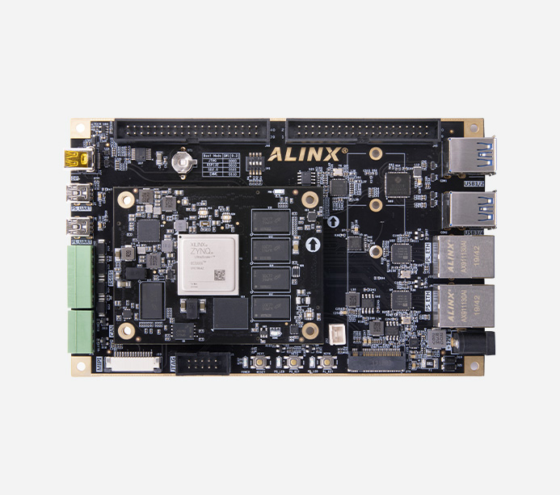
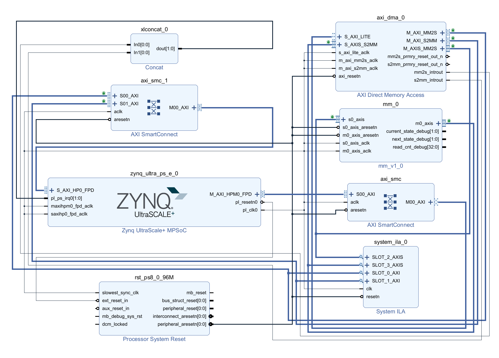
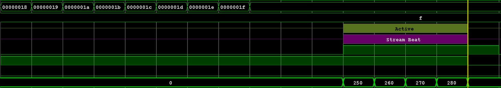

# FPGA: 矩阵乘法 

宋雨桐

---

## ZYNQ UltraScale+ MPSoCs 开发平台

四核ARM Cortex-A53和FPGA可编程逻辑集成在一颗芯片上

- ARM处理器负责调度
- FPGA作为外设负责运算

**ARM+FPGA**的协作，其本质上就是**异构计算**，和现代PC上的**CPU+GPU**模型非常类似。



---

## ARM+FPGA与CPU+GPU协作架构对比表

<style scoped>
table {
    height: 100%;
    width: 100%;
    font-size: 17px;
}
section {
    align-items: center;
    justify-content: center;
}
section.table-container {
display: flex;
text-align: center;
margin: 0 auto;
justify-content: center;
align-items: center;
}
</style>

<section class="table-container">

| 对比维度                 | ARM + FPGA 协作架构                         | CPU + GPU 协作架构                            |
|-------------------------|--------------------------------------------|-----------------------------------------------|
| **计算单元**            | ARM CPU + 可编程逻辑 (FPGA)                | x86/ARM CPU + 固定架构 GPU                   |
| 可定制性            | 极高（硬件逻辑可自定义）                | 低（运算单元固定）                       |
| 计算吞吐率          | 中等（取决于 FPGA规模）                    | 超高（专为并行运算设计，TFlops 级别）     |
| **延迟 & 实时性**       | 超低 & 硬件级确定性                    | 较高 & 受调度和系统负载影响               |
| 功耗                | 极低（同等性能下远低于 GPU）            | 高（高性能 GPU 通常 200W-400W 以上）         |
| **内存带宽**            | **低~中等**（AXI 总线, BRAM/URAM/HBM）         | **极高**（PCIe 4.0/5.0 + HBM 显存，最高 1TB/s）  |
| **内存容量**            | **有限**（板上内存通常几 MB ~ 几 GB）        | **大**（GPU 显存通常 8GB ~ 80GB）                |
| **板级带宽**            | **高**（ARM 和 FPGA 片上直连，无需 PCIe）   | PCIe 通讯，**带宽受限**                           |
| 系统集成度          | 高（MPSoc 单芯片，ARM+FPGA在同一 SoC）  | 低（CPU 和 GPU 多为独立芯片，需PCIe连接）    |
| 接口扩展能力        | 强（FPGA原生支持 GPIO, SPI, Ethernet 等）| 弱（GPU仅用于通用计算和图形渲染）            |
| 开发门槛            | 高（需掌握 Verilog/VHDL/HLS + ARM开发）| 低（CUDA/OpenCL/PyTorch等生态成熟）         |
| 生态支持           | 中等（Xilinx, Intel FPGA 工具链）           | 完善（CUDA, ROCm, TensorRT 等）          |
| 适用场景            | 低延迟推理、实时控制、边缘计算、定制加速| 大规模并行计算、AI训练、图形渲染       |

</section>

---

<style scoped>
section {
font-size:20px;
}
</style>

## 目前工作：硬件配置（Vivado）<!-- fit -->

- UART：串行输出
- PS-PL接口：开放两个高速接口负责读写
- AXI DMA：直接内存访问，用于DDR4和FPGA之间的数据搬运
- FPGA逻辑：使用AXI4 Stream接口，一次可以计算8x8矩阵乘法



---

## 目前工作：硬件配置(Vivado) 

<style scoped>
.code-layout {
  display: flex;
  justify-content: space-between;
  align-items: flex-start; /* 垂直顶部对齐 */
  flex-wrap: wrap;
}

.code-container {
  width: 48%; /* 控制代码块宽度 */
}

.text-container {
  width: 48%; /* 控制文字宽度 */
  font-size: 22px;
}
</style>

<div class="code-layout">
<div class="code-container"> 

```verilog
module mm 
(
    // AXI4-Stream Slave Interface (输入矩阵数据)
    input  wire                         s0_axis_aclk,
    input  wire                         s0_axis_aresetn,
    output reg                          s0_axis_tready,
    input  wire [C_S0_AXIS_TDATA_WIDTH-1:0] s0_axis_tdata,
    input  wire [(C_S0_AXIS_TDATA_WIDTH/8)-1:0] s0_axis_tstrb,
    input  wire                         s0_axis_tlast,
    input  wire                         s0_axis_tvalid,

    // AXI4-Stream Master Interface (输出矩阵乘积)
    input  wire                         m0_axis_aclk,
    input  wire                         m0_axis_aresetn,
    output reg                          m0_axis_tvalid,
    output reg [C_M0_AXIS_TDATA_WIDTH-1:0] m0_axis_tdata,
    output reg [(C_M0_AXIS_TDATA_WIDTH/8)-1:0] m0_axis_tstrb,
    output reg                          m0_axis_tlast,
    input  wire                         m0_axis_tready
);
// 状态机定义：
// STATE_IDLE  : 复位后进入，准备接收数据
// STATE_READ  : 通过 s0_axis 接口连续接收两个矩阵的数据
// STATE_CALC  : 计算矩阵乘法（所有乘法加法并行展开）
// STATE_WRITE : 通过 m0_axis 接口将结果矩阵按顺序输出
localparam STATE_IDLE  = 2'd0;
localparam STATE_READ  = 2'd1;
localparam STATE_CALC  = 2'd2;
localparam STATE_WRITE = 2'd3;
... 
endmodule
```

</div>

<div class="text-container">

```verilog
for(i = 0; i < N; i = i + 1) begin
    for(j = 0; j < N; j = j + 1) begin
        mult_sum = 0;
        for(k = 0; k < N; k = k + 1) begin
            mult_sum = mult_sum + A[i][k] * B[k][j];
        end
        C[i][j] <= mult_sum;
    end
end
```

- AXI4 Stream 接口
    - Slave: 接收数据
    - Master：发送数据
- 并行计算逻辑：一个时钟周期计算8x8矩阵乘法 <!-- fit -->

</div>
</div>

---

## 目前工作：软件配置（Vitis）

<style scoped>
.text-container {
font-size:20px;
}
</style>

<div class="text-container">

- DMA初始化、传输数据、复位

```c
// mpsoc_hw
int init_hw(XAxiDma *AxiDma);
int wait_dma_reset(XAxiDma *AxiDma);
int wait_dma_idle(XAxiDma *AxiDma, u8 direction);
int dma_transfer(XAxiDma *AxiDma, u32 *tx_buf_a, u32 *tx_buf_b, u32 *rx_buf_c);
```

- 大型矩阵分块计算

```c
// mat_mult
typedef struct {
	u32 *mat_a;
	u32 *mat_b;
	u32 *mat_c;
	u32 *blk_tmp;
	XAxiDma AxiDma;
} MatCalc;

u32 *mat_get_block(u32 *mat, int blk_row, int blk_col);
int  mat_calc(MatCalc *m);
void mat_init_example(MatCalc *m);
u32  mat_get(u32 *mat, int i, int j);
void mat_put(u32 *mut, int i, int j, u32 value);
void mat_print(u32 *mat);
```

</div>

---

<style scoped>
.img-container {
text-align: center;
}
</style>

## 遇到的问题  

经实际上板测试，FPGA实现的矩阵乘法程序，其性能甚至低于未经过并行优化的 CPU 程序。

## 分析原因

- DMA本质上是串行传输器，对于FPGA来说，每个时钟周期只能接收一个数据
    - 传输数据周期数：`> MATRIX_SIZE*MATRIX_SIZE*3`
    - 矩阵计算周期数：`1`
- FPGA端没有缓存，导致大量数据被多次重复传输

<div class="img-container">



</div>

---

## 拟解决方案

- 用**板上带宽**优势取代**内存带宽**劣势
    - FPGA周围的BRAM类似于GPU周围的显存
    - 将BRAM直接映射到内存，CPU使用`bramMalloc()`，利用PS-PL高速接口将数据直接写入BRAM

---

# 谢谢大家

宋雨桐
